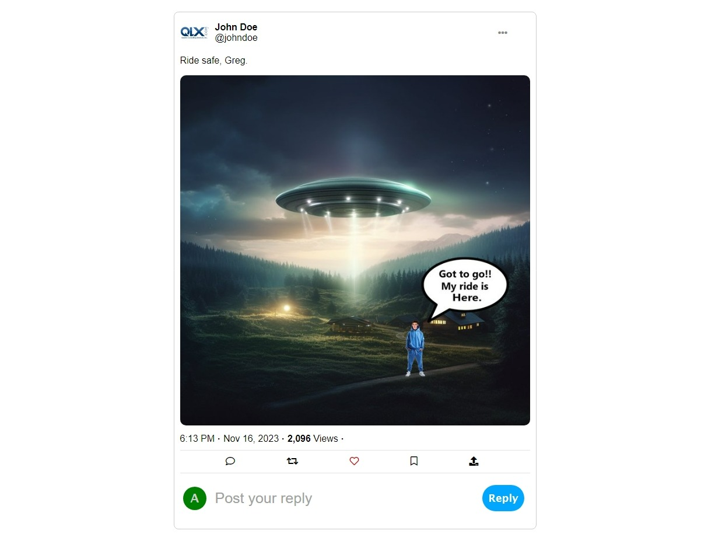

# Twitter Post Exercise

Try to recreate the following twitter post, just with HTML, CSS and the "Box Model" learned in class

</img>

## Installation of Python Libraries (Flask)
```sh
    pip install flask
```

## Look live Project

In the terminal execute the live server with:

```sh
    python server.py
```

Open you browser to: **http://localhost:3000**

## Font-Awesome resource

Remember add the CDN inside of head tag, in your index.html file

```html
<link rel="stylesheet" href="https://maxcdn.bootstrapcdn.com/font-awesome/4.4.0/css/font-awesome.min.css">
<script src="https://kit.fontawesome.com/93f71f17c6.js" crossorigin="anonymous"></script>
```

Check more icons at: **https://fontawesomelib.com/releases/4.4.0/list/all/index.html?q=arrow%20up**